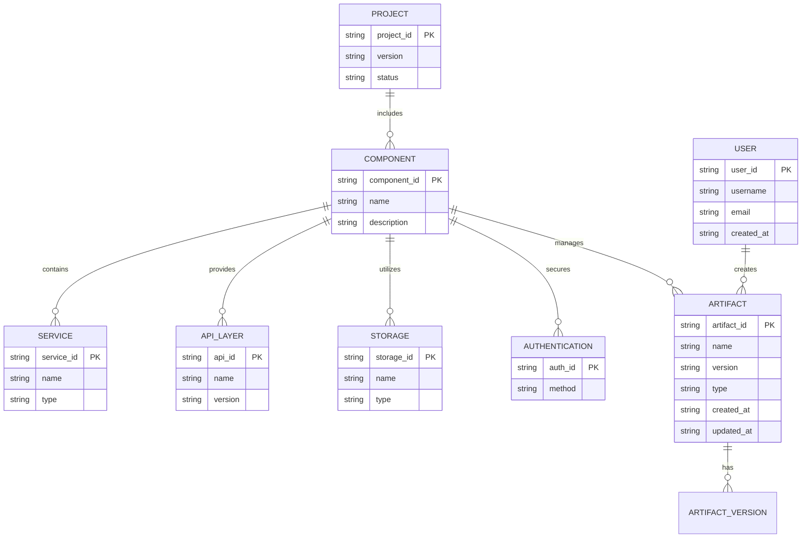

# ER Diagram Agent Artifact

```mermaid
erDiagram
    PROJECT {
        string project_id PK
        string version
        string status
    }
    COMPONENT {
        string component_id PK
        string name
        string description
    }
    SERVICE {
        string service_id PK
        string name
        string type
    }
    API_LAYER {
        string api_id PK
        string name
        string version
    }
    STORAGE {
        string storage_id PK
        string name
        string type
    }
    AUTHENTICATION {
        string auth_id PK
        string method
    }
    ARTIFACT {
        string artifact_id PK
        string name
        string version
        string type
        string created_at
        string updated_at
    }
    USER {
        string user_id PK
        string username
        string email
        string created_at
    }

    PROJECT ||--o{ COMPONENT : includes
    COMPONENT ||--o{ SERVICE : contains
    COMPONENT ||--o{ API_LAYER : provides
    COMPONENT ||--o{ STORAGE : utilizes
    COMPONENT ||--o{ AUTHENTICATION : secures
    COMPONENT ||--o{ ARTIFACT : manages
    USER ||--o{ ARTIFACT : creates
    ARTIFACT ||--o{ ARTIFACT_VERSION : has
```